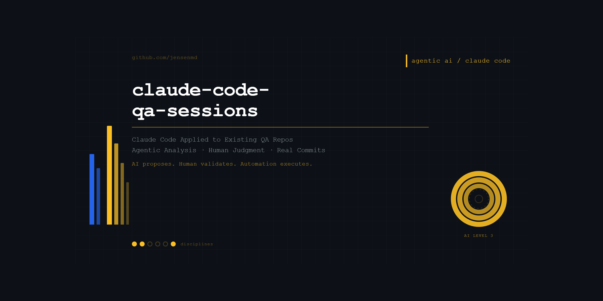

# claude-code-qa-sessions

Documenting Claude Code applied to existing QA repositories — coverage gap analysis, human-in-the-loop validation, and agentic implementation.

This is not a tutorial clone. These are real sessions against real projects, documented as a replicable workflow for any QA engineer who wants to understand how to integrate Claude Code into their existing practice.

🔗 [LinkedIn](https://www.linkedin.com/in/michaeljensen-qa/) | 🐙 [GitHub Profile](https://github.com/jensenmd) | 📧 [jensen.md@gmail.com](mailto:jensen.md@gmail.com)

---

## What This Is

Claude Code is an agentic AI tool that reads, reasons about, and modifies codebases autonomously. This repo documents what happens when you point it at existing QA projects — what it finds, what it proposes, and how human judgment shapes the outcome.

The workflow demonstrated here:
1. Claude Code analyzes an existing codebase autonomously
2. Identifies real coverage gaps with specific, actionable suggestions
3. Human evaluates each suggestion with QA judgment
4. Human directs the implementation approach
5. Claude Code implements — human reviews the diff
6. Human commits and pushes

**AI proposes. Human validates. Automation executes.**

---

## Sessions

### Session 1 — restful-booker-qa
**Subject:** Full-stack QA project — REST API testing (Postman/Newman) + UI automation (Playwright)
**Date:** April 28, 2026
**Claude Code Version:** 2.1.122

[→ View Session 1 Details](sessions/restful-booker-qa/README.md)

**What Claude Code found:**
- Weak negative assertion in empty form validation test
- Missing confirmation data verification in happy path test
- Single room type hardcoded across all booking tests

**Human judgment applied:**
- Rejected string-based error message assertions (fragility risk)
- Chose error container visibility assertion instead
- Deferred room type coverage expansion to future session

**Result:** One targeted improvement committed and pushed — stronger test coverage without brittleness.

---

## QA Portfolio Quick Reference

This project is part of a broader QA portfolio demonstrating complementary quality-engineering skills.

| Project | Focus |
|---|---|
| [android-appium-wdio-poc](https://github.com/jensenmd/android-appium-wdio-poc) | Native Android UI automation proof of concept using Appium, WebdriverIO, TypeScript, and UiAutomator2 |
| [mapmyrun-quality-investigation](https://github.com/jensenmd/mapmyrun-quality-investigation) | Black-box mobile and GPS quality investigation using field evidence and bounded conclusions |
| [restful-booker-qa](https://github.com/jensenmd/restful-booker-qa) | Layered API and UI automation using Postman, Newman, Playwright, and GitHub Actions |
| [pharmacy-spend-etl-qa](https://github.com/jensenmd/pharmacy-spend-etl-qa) | ETL pipeline and SQL-driven data-integrity validation modeled after healthcare analytics work |
| [qa-automation-showcase](https://github.com/jensenmd/qa-automation-showcase) | REST API testing, data validation, and CI/CD-integrated automation |
| [ai-qa-framework](https://github.com/jensenmd/ai-qa-framework) | Human-reviewed AI-assisted test generation with structured cases and pytest execution |
| [claude-code-qa-sessions](https://github.com/jensenmd/claude-code-qa-sessions) | Agentic analysis of existing QA repositories with human review and targeted implementation |
| [agentqa-orchestrator](https://github.com/jensenmd/agentqa-orchestrator) | Structured agentic code auditing using Python, Pydantic, Gemini, and JSON |
---

## Author

---

## Author

**Michael D. Jensen** — Senior QA Engineer
15+ years of enterprise software testing experience across healthcare IT, financial systems, telecommunications, and cybersecurity.

🔗 [LinkedIn](https://www.linkedin.com/in/michaeljensen-qa/) | 🐙 [GitHub Profile](https://github.com/jensenmd) | 📧 [jensen.md@gmail.com](mailto:jensen.md@gmail.com)
